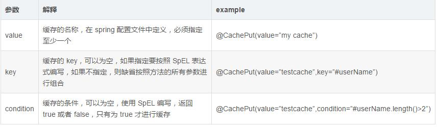

## spring boot 集成redis版本说明

**官网文档：https://docs.spring.io/spring-boot/docs/2.0.2.RELEASE/reference/htmlsingle/** 

**当前版本是2.0.3（目前官网的当前版本也是2.0.3 {2018-06-25}）**


**1.5.X版本redis依赖如下：**

```
<dependency>
    <groupId>org.springframework.boot</groupId>
    <artifactId>spring-boot-starter-data-redis</artifactId>
</dependency>
```

**2.0.X版本redis依赖如下：**
```
引用方式一：
<dependency>
    <groupId>org.springframework.data</groupId>
    <artifactId>spring-data-redis</artifactId>
    <exclusions>
        <exclusion>
            <groupId>org.slf4j</groupId>
            <artifactId>jcl-over-slf4j</artifactId>
        </exclusion>
    </exclusions>
</dependency>
<dependency>
    <groupId>redis.clients</groupId>
    <artifactId>jedis</artifactId>
</dependency>

说明：直接使用spring-data-redis ，引用jedis客户端

引用方式二：
<dependency>
    <groupId>org.springframework.boot</groupId>
    <artifactId>spring-boot-starter-data-redis</artifactId>
    <exclusions>
        <exclusion>
            <groupId>io.lettuce</groupId>
            <artifactId>lettuce-core</artifactId>
        </exclusion>
    </exclusions>
</dependency>
<dependency>
    <groupId>redis.clients</groupId>
    <artifactId>jedis</artifactId>
</dependency>

说明：默认情况下，Spring Boot starter（spring-boot-starter-data-redis）使用 Lettuce。您需要排除该依赖关系，并包含Jedis。Spring Boot管理这些依赖关系，以便尽可能简化此过程。

```


## spring boot caching与redis集成方案

**配置RedisConfig.java**

```
@Configuration
@EnableCaching
public class RedisConfig extends CachingConfigurerSupport {

    @Bean
    JedisConnectionFactory jedisConnectionFactory() {
        return new JedisConnectionFactory();
    }
    
    /**
     * spring boot 2.0.x以上版本的使用方式
     * @param redisConnectionFactory
     * @return
     */
    @SuppressWarnings("rawtypes")
    @Bean
    public CacheManager cacheManager(RedisConnectionFactory redisConnectionFactory) {
        RedisCacheManager rcm = RedisCacheManager.builder(redisConnectionFactory).build();
        return rcm;
    }
    
   /**
     * 自定义生成redis-key
     *  lambda表达式
     * @return
     */
    @Override
    public KeyGenerator keyGenerator() {
        return (o, method, objects)->{
            StringBuilder sb = new StringBuilder();
            sb.append(o.getClass().getName()).append(".");
            sb.append(method.getName()).append(".");
            for (Object obj : objects) {
                sb.append(obj.toString());
            }
            System.out.println("keyGenerator=" + sb.toString());
            return sb.toString();
        };

    }

    @Bean
    public RedisTemplate redisTemplate(RedisConnectionFactory redisConnectionFactory) {
        RedisTemplate template = new RedisTemplate();
        template.setConnectionFactory(redisConnectionFactory);//注入redis数据源
        template.setKeySerializer(new StringRedisSerializer());//设置key的序列化方式
        template.setValueSerializer(new RedisObjectSerializer());//设置value的序列化方式
        return template;
    }
}
```

@EnableCaching 开启caching功能  引入CachingConfigurationSelector自动配置，导入Caching相关注解拦截功能

CacheManager 由RedisCacheManager实现：RedisCacheManager.builder(redisConnectionFactory).build();（2.0.x版本）


**配置RedisObjectSerializer序列化方式**
```
/**
 * redis 序列化方式
 *
 *
 */
public class RedisObjectSerializer implements RedisSerializer<Object> {

  private Converter<Object, byte[]> serializer = new SerializingConverter();
  private Converter<byte[], Object> deserializer = new DeserializingConverter();

  static final byte[] EMPTY_ARRAY = new byte[0];

  public Object deserialize(byte[] bytes) {
    if (isEmpty(bytes)) {
      return null;
    }

    try {
      return deserializer.convert(bytes);
    } catch (Exception ex) {
      throw new SerializationException("Cannot deserialize", ex);
    }
  }

  public byte[] serialize(Object object) {
    if (object == null) {
      return EMPTY_ARRAY;
    }

    try {
      return serializer.convert(object);
    } catch (Exception ex) {
      return EMPTY_ARRAY;
    }
  }

  private boolean isEmpty(byte[] data) {
    return (data == null || data.length == 0);
  }
}
```
对key/value的存储进行自定义的序列化

## Spring cache的注解如何使用

在spring cache与redis集成之后，我们就可以使用spring cache自带的注解功能

缓存的主要使用方式包括以下两方面 
1. 缓存的声明，需要根据项目需求来妥善的应用缓存 
2. 缓存的配置方式，选择需要的缓存支持，例如Ecache、redis、memercache等

**@CacheConfig：该注解是可以将缓存分类，它是类级别的注解方式。**
@CacheConfig(cacheNames = "xxx")统一声明 @Cacheable(value="xxx")的属性，简单明了.
@CacheConfig is a class-level annotation that allows to share the cache names，如果你在你的方法写别的名字，那么依然以方法的名字为准。
```
eg： 
@CacheConfig(cacheNames = "user")
@Service
public class UserCacheRedisService {}

说明：
@CacheConfig(cacheNames = "user"), 使UserCacheRedisService的所有缓存注解， value值就都为user。
```
**@Cacheable：主要针对方法配置，能够根据方法的请求参数对其结果进行缓存**
1.如果key不存在，执行方法体，并将结果更新到缓存中。
2.如果key存在，直接查询缓存中的数据。

**@Cacheable 作用和配置方法**


```
@Cacheable
public List<User> selectAllUser(){
    log.info("selectAllUser execute");
    return data;
}

@Cacheable(value = "getUser", key = "#id")
public User getUser(int id){
    User user = new User();
    user.setId(id);
    user.setAge(20);
    user.setUsername("玛雅文明");
    log.info("getUser execute");
    return user;
}
```
**@CachePut：主要针对方法配置，能够根据方法的请求参数对其结果进行缓存，和 @Cacheable 不同的是，它每次都会执行方法体**
1. 如果key存在，更新内容 
2. 如果key不存在，插入内容。
**@CachePut 作用和配置方法**



```
@CachePut(value="saveOfUpdate", key = "\"user_\" + #user.id")
public User saveOfUpdate(User user){
    log.info("saveOfUpdate execute");
    return user;
}
```

**@CachEvict： 主要针对方法配置，能够根据一定的条件对缓存进行清空，执行方法体**

**@CacheEvict 作用和配置方法**


```
/**
 * 清空指定key缓存
 * @param user
 */
@CacheEvict(value="saveOfUpdate", key="\"user_\" + #user.getId()")
public void clearUser(User user) {
    log.info("clearUser execute");
}

/**
 * allEntries：是否清空所有缓存内容，缺省为 false，如果指定为 true，则方法调用后将立即清空所有缓存
 */
@CacheEvict(value="saveOfUpdate", allEntries=true)
public void flushCacle() {
    log.info("flushCacle execute");
}

```
**条件缓存**
下面提供一些常用的条件缓存

```
//@Cacheable将在执行方法之前( #result还拿不到返回值)判断condition，如果返回true，则查缓存； 
@Cacheable(value = "user", key = "#id", condition = "#id lt 10")
public User conditionFindById(final Long id)  

//@CachePut将在执行完方法后（#result就能拿到返回值了）判断condition，如果返回true，则放入缓存； 
@CachePut(value = "user", key = "#id", condition = "#result.username ne 'zhang'")  
public User conditionSave(final User user)   

//@CachePut将在执行完方法后（#result就能拿到返回值了）判断unless，如果返回false，则放入缓存；（即跟condition相反）
@CachePut(value = "user", key = "#user.id", unless = "#result.username eq 'zhang'")
public User conditionSave2(final User user)   

//@CacheEvict， beforeInvocation=false表示在方法执行之后调用（#result能拿到返回值了）；且判断condition，如果返回true，则移除缓存；
@CacheEvict(value = "user", key = "#user.id", beforeInvocation = false, condition = "#result.username ne 'zhang'")  
public User conditionDelete(final User user)   

```
**@Caching**

有时候我们可能组合多个Cache注解使用；比如用户新增成功后，我们要添加id–>user；username—>user；email—>user的缓存；此时就需要@Caching组合多个注解标签了。

```
@Caching(put = {
@CachePut(value = "user", key = "#user.id"),
@CachePut(value = "user", key = "#user.username"),
@CachePut(value = "user", key = "#user.email")
})
public User save(User user) {
```

**自定义缓存注解**

@Caching组合，会让方法显的较臃肿，可以通过自定义注解把这些注解组合到一个注解中，如：
```
@Caching(put = {
@CachePut(value = "user", key = "#user.id"),
@CachePut(value = "user", key = "#user.username"),
@CachePut(value = "user", key = "#user.email")
})
@Target({ElementType.METHOD, ElementType.TYPE})
@Retention(RetentionPolicy.RUNTIME)
@Inherited
public @interface UserSaveCache {
}

使用：
@UserSaveCache
public User save(User user){
 //do something
}

```

**扩展**

比如findByUsername时，不应该只放username–>user，应该连同id—>user和email—>user一起放入；这样下次如果按照id查找直接从缓存中就命中了

```
@Caching(
    cacheable = {
       @Cacheable(value = "user", key = "#username")
    },
    put = {
       @CachePut(value = "user", key = "#result.id", condition = "#result != null"),
       @CachePut(value = "user", key = "#result.email", condition = "#result != null")
    }
)
public User findByUsername(final String username) {
    System.out.println("cache miss, invoke find by username, username:" + username);
    for (User user : users) {
        if (user.getUsername().equals(username)) {
            return user;
        }
    }
    return null;
}
```

其实对于：id—>user；username—->user；email—>user；更好的方式可能是：id—>user；username—>id；email—>id；保证user只存一份；如：

```
@CachePut(value="cacheName", key="#user.username", cacheValue="#user.username")  
public void save(User user)   


@Cacheable(value="cacheName", key="#user.username", cacheValue="#caches[0].get(#caches[0].get(#username).get())")  
public User findByUsername(String username)  
```


## Redis 序列化方式以及相互之间的比较

当我们的数据存储到Redis的时候，我们的键（key）和值（value）都是通过Spring提供的Serializer序列化到数据库的。

```
RedisTemplate默认使用的是JdkSerializationRedisSerializer
StringRedisTemplate默认使用的是StringRedisSerializer
```

Spring Data Redis（1.4.7版本）为我们提供了下面的Serializer：

    GenericToStringSerializer、GenericJackson2JsonRedisSerializer、Jackson2JsonRedisSerializer、JacksonJsonRedisSerializer、JdkSerializationRedisSerializer、StringRedisSerializer。
    

序列化方式对比：
```
* GenericToStringSerializer：可以将任何对象泛化为字符串并序列化
* GenericJackson2JsonRedisSerializer：使用Jackson库将对象序列化为JSON字符串。
    优点：是速度快，序列化后的字符串短小精悍，不需要实现Serializable接口，会在json中加入@class属性，类的全路径包名，方便反序列化
    缺点：也非常致命，那就是此类的构造函数中有一个类型参数，必须提供要序列化对象的类型信息(.class对象)。 通过查看源代码，发现其只在反序列化过程中用到了类型信息，时间消耗比JDK长。
* JdkSerializationRedisSerializer: 使用JDK提供的序列化功能。 
    优点：是反序列化时不需要提供类型信息(class)，最高效的
    缺点：是需要实现Serializable接口，还有序列化后的结果非常庞大，是JSON格式的5倍左右，这样就会消耗redis服务器的大量内存。
* Jackson2JsonRedisSerializer： 使用Jackson库将对象序列化为JSON字符串。
    优点：是速度快，序列化后的字符串短小精悍，不需要实现Serializable接口。
    缺点：也非常致命，那就是此类的构造函数中有一个类型参数，必须提供要序列化对象的类型信息(.class对象)。 通过查看源代码，发现其只在反序列化过程中用到了类型信息，时间消耗比JDK长。
         无法指定List容器里面元素的类，所以反序列化时直接将元素反序列化成了LinkedHashMap导致返回结果的时候强制类型转化报错。
* StringRedisSerializer：简单的字符串序列化，一般如果key-value都是string的话，使用StringRedisSerializer就可以了

```

**JedisConnectionFactory配置介绍**：

**一.简单配置**

**application.properties**

```
# REDIS (RedisProperties)
# Redis数据库索引（默认为0）
spring.redis.database=0  
# Redis服务器地址
spring.redis.host=192.168.127.131  
# Redis服务器连接端口
spring.redis.port=6379  
# Redis服务器连接密码（默认为空）
spring.redis.password=q1w2e3r4  
# 连接池最大连接数（使用负值表示没有限制）
spring.redis.pool.max-active=8  
# 连接池最大阻塞等待时间（使用负值表示没有限制）
spring.redis.pool.max-wait=-1  
# 连接池中的最大空闲连接
spring.redis.pool.max-idle=8  
# 连接池中的最小空闲连接
spring.redis.pool.min-idle=0  
# 连接超时时间（毫秒）
spring.redis.timeout=0

```
**RedisConfig配置**

```
@Configuration
@EnableCaching
public class RedisConfig extends CachingConfigurerSupport {
    
    /**
     * 默认，只能连接本地，连接其他网络添加
     * jedisConnectionFactory.setHostName(host);
     * jedisConnectionFactory.setPort(port);
     * 
     */
    @Bean
    JedisConnectionFactory jedisConnectionFactory() {
        return new JedisConnectionFactory(); 
    }

    
    @SuppressWarnings("rawtypes")
    @Bean
    @Bean
        public CacheManager cacheManager(@SuppressWarnings("rawtypes") RedisTemplate redisTemplate) {
            RedisCacheManager redisCacheManager = new RedisCacheManager(redisTemplate);
            redisCacheManager.setDefaultExpiration(300);
            return redisCacheManager;
        }

    /**
     * 自定义生成redis-key
     *  lambda表达式
     * @return
     */
    @Override
    public KeyGenerator keyGenerator() {
        return (o, method, objects)->{
            StringBuilder sb = new StringBuilder();
            sb.append(o.getClass().getName()).append(".");
            sb.append(method.getName()).append(".");
            for (Object obj : objects) {
                sb.append(obj.toString());
            }
            System.out.println("keyGenerator=" + sb.toString());
            return sb.toString();
        };

    }

    @Bean
    public RedisTemplate redisTemplate(RedisConnectionFactory redisConnectionFactory) {
        RedisTemplate template = new RedisTemplate();
        template.setConnectionFactory(redisConnectionFactory);//注入redis数据源
        template.setKeySerializer(new StringRedisSerializer());//设置key的序列化方式
        //template.setValueSerializer(new RedisObjectSerializer());//设置value的序列化方式一
        template.setValueSerializer(jackRedisSerializer());//设置value的序列化方式二 推荐这种方式，这种方式不会乱码
        return template;
    }

    public Jackson2JsonRedisSerializer jackRedisSerializer(){
        // 使用Jackson2JsonRedisSerialize 替换默认序列化
        Jackson2JsonRedisSerializer jackson2JsonRedisSerializer = new Jackson2JsonRedisSerializer(Object.class);

        ObjectMapper objectMapper = new ObjectMapper();
        objectMapper.setVisibility(PropertyAccessor.ALL, JsonAutoDetect.Visibility.ANY);
        objectMapper.enableDefaultTyping(ObjectMapper.DefaultTyping.NON_FINAL);

        jackson2JsonRedisSerializer.setObjectMapper(objectMapper);

        return jackson2JsonRedisSerializer;
    }
    
}
```

二.带jedispool的配置

```

@Configuration
@EnableCaching
public class RedisConfig extends CachingConfigurerSupport {

    @Value("${spring.redis.host}")
    private String host;

    @Value("${spring.redis.password}")
    private String password;

    @Value("${spring.redis.port}")
    private int port;

    @Value("${spring.redis.timeout}")
    private int timeout;

    @Value("${spring.redis.database}")
    private int defaultDatabaseIndex;

    @Value("${spring.redis.pool.max-idle}")
    private int maxIdle;

    @Value("${spring.redis.pool.min-idle}")
    private int minIdle;

    @Value("${spring.redis.pool.max-active}")
    private int maxActive;

    @Value("${spring.redis.pool.max-wait}")
    private long maxWaitMillis;


    @Bean
    public RedisConnectionFactory connectionFactory() {
        JedisConnectionFactory jedisConnectionFactory = new JedisConnectionFactory();
        jedisConnectionFactory.setHostName(host);
        jedisConnectionFactory.setPort(port);
        jedisConnectionFactory.setTimeout(timeout);
        if (!StringUtils.isEmpty(password)) {
            jedisConnectionFactory.setPassword(password);
        }
        if (defaultDatabaseIndex != 0) {
            jedisConnectionFactory.setDatabase(defaultDatabaseIndex);
        }
        jedisConnectionFactory.setPoolConfig(poolConfig());
        // 初始化连接pool
        jedisConnectionFactory.afterPropertiesSet();
        return jedisConnectionFactory;
    }

    public JedisPoolConfig poolConfig() {
        JedisPoolConfig jedisPoolConfig = new JedisPoolConfig();
        jedisPoolConfig.setMaxTotal(maxActive);
        jedisPoolConfig.setMinIdle(minIdle);
        jedisPoolConfig.setMaxIdle(maxIdle);
        jedisPoolConfig.setMaxWaitMillis(maxWaitMillis);
        return jedisPoolConfig;
    }

    /**
     * spring boot 1.3.x~1.5.x版本
     * @param redisTemplate
     * @return
     */
    // 定制缓存管理器的属性，默认提供的CacheManager对象可能不能满足需要
    // 因此建议依赖业务和技术上的需求，自行做一些扩展和定制
    // 这样就可以在使用Spring4中的@Cacheable、@CachePut、@CacheEvict 注解了
    // 使用cache注解管理redis缓存
    @Bean
    public CacheManager cacheManager(@SuppressWarnings("rawtypes") RedisTemplate redisTemplate) {
        RedisCacheManager redisCacheManager = new RedisCacheManager(redisTemplate);
        redisCacheManager.setDefaultExpiration(300);
        return redisCacheManager;
    }

    /**
     * 自定义生成redis-key
     *  lambda表达式
     * @return
     */
    @Override
    public KeyGenerator keyGenerator() {
        return (o, method, objects)->{
            StringBuilder sb = new StringBuilder();
            sb.append(o.getClass().getName()).append(".");
            sb.append(method.getName()).append(".");
            for (Object obj : objects) {
                sb.append(obj.toString());
            }
            System.out.println("keyGenerator=" + sb.toString());
            return sb.toString();
        };

    }

    @Bean
    public RedisTemplate redisTemplate(RedisConnectionFactory redisConnectionFactory) {
        RedisTemplate template = new RedisTemplate();
        template.setConnectionFactory(redisConnectionFactory);//注入redis数据源
        template.setKeySerializer(new StringRedisSerializer());//设置key的序列化方式
        //template.setValueSerializer(new RedisObjectSerializer());//设置value的序列化方式一
        template.setValueSerializer(jackRedisSerializer());//设置value的序列化方式二 推荐这种方式，这种方式不会乱码
        return template;
    }

    public Jackson2JsonRedisSerializer jackRedisSerializer(){
        // 使用Jackson2JsonRedisSerialize 替换默认序列化
        Jackson2JsonRedisSerializer jackson2JsonRedisSerializer = new Jackson2JsonRedisSerializer(Object.class);

        ObjectMapper objectMapper = new ObjectMapper();
        objectMapper.setVisibility(PropertyAccessor.ALL, JsonAutoDetect.Visibility.ANY);
        objectMapper.enableDefaultTyping(ObjectMapper.DefaultTyping.NON_FINAL);

        jackson2JsonRedisSerializer.setObjectMapper(objectMapper);

        return jackson2JsonRedisSerializer;
    }
}

```
