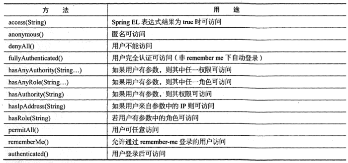
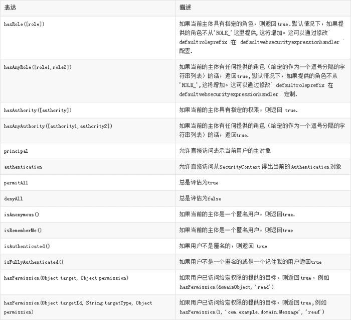
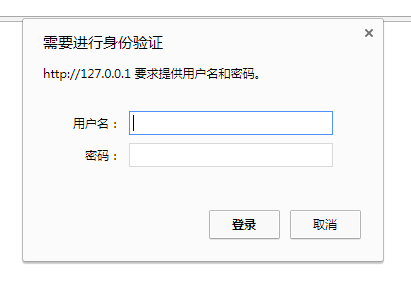
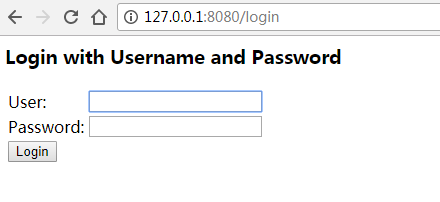
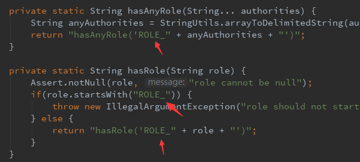
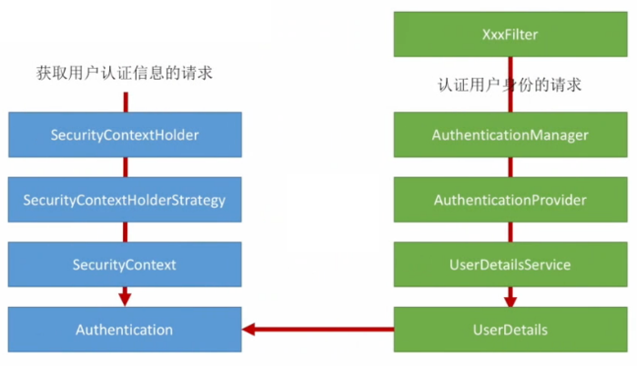

## spring boot Security使用介绍

**pom.xml添加依赖**

```
<dependency>
    <groupId>org.springframework.boot</groupId>
    <artifactId>spring-boot-starter-security</artifactId>
</dependency>
```

**创建一个类并继承WebSecurityConfigurerAdapter，并在类中重新3个方法：**  
1.protected void configure(AuthenticationManagerBuilder auth)：身份验证管理生成器  
2.protected void configure(HttpSecurity http)：HTTP请求安全处理  
3.protected void configure(WebSecurity web)：WEB安全处理  

```
@Configuration
@EnableWebSecurity//开启security
public class SecurityConfiguration extends WebSecurityConfigurerAdapter {

       @Override
       protected void configure(AuthenticationManagerBuilder auth){
            super.configure(auth);
       }

       @Override
       protected void configure(HttpSecurity http){
            super.configure(http);
       }

       @Override
       protected void configure(WebSecurity web){
            super.configure(web);
       }
｝
```

**protected void configure(HttpSecurity http)这个方法提供了一个默认的配置**

```
protected void configure(HttpSecurity http) throws Exception {
    http
        .authorizeRequests()
            .anyRequest().authenticated()
            .and()
        .formLogin()
            .and()
        .httpBasic();
}
```
http.authorizeRequests()其中这里的意思是指通过authorizeRequests()方法来开始请求权限配置。

而接着的.anyRequest().authenticated()是对http所有的请求必须通过授权认证才可以访问










而and()是返回一个securityBuilder对象，formLogin()和httpBasic()是授权的两种方式。

当然这些界面都是spring security原生的界面，我们也可以自定义我们的formLogin页面！

```
protected void configure(HttpSecurity http) throws Exception {
    http
        .authorizeRequests()
            .anyRequest().authenticated()//任何请求都要通过authorizeRequests()方法来开始请求权限配置。
            .and()
        .formLogin()
            //指定登录页的路径
            .loginPage("/login") 
            //必须允许所有用户访问我们的登录页（例如未验证的用户，否则验证流程就会进入死循环）
            //这个formLogin().permitAll()方法允许所有用户基于表单登录访问/login这个page。
            .permitAll();        
}

```
提示一下，这个自定义表单登录的自定义页面中的登录名参数必须被命名为username
密码参数必须被命名为password。
而接下来当我们需要对某些开放的url，给与任何人访问的时候，我们应该如何设置呢？答案很简单我们先看着代码慢慢深入！

```
protected void configure(HttpSecurity http) throws Exception {
    http
        //http.authorizeRequests()方法有多个子节点，每个macher按照他们的声明顺序执行     
        .authorizeRequests()      

             //我们指定任何用户都可以访问多个URL的模式。
             //任何用户都可以访问以"/resources/","/signup", 或者 "/about"开头的URL。                                                     
            .antMatchers("/resources/**", "/signup", "/about").permitAll()     

             //以 "/admin/" 开头的URL只能让拥有 "ROLE_ADMIN"角色的用户访问。
             //请注意我们使用 hasRole 方法，没有使用 "ROLE_" 前缀。               
            .antMatchers("/admin/**").hasRole("ADMIN")               
 
             //任何以"/db/" 开头的URL需要同时具有 "ROLE_ADMIN" 和 "ROLE_DBA"权限的用户才可以访问。
             //和上面一样我们的 hasRole 方法也没有使用 "ROLE_" 前缀。              
            .antMatchers("/db/**").access("hasRole('ADMIN') and hasRole('DBA')")       

             //任何以"/db/" 开头的URL只需要拥有 "ROLE_ADMIN" 和 "ROLE_DBA"其中一个权限的用户才可以访问。
            //和上面一样我们的 hasRole 方法也没有使用 "ROLE_" 前缀。          
            .antMatchers("/db/**").hasAnyRole("ADMIN", "DBA")    

             //尚未匹配的任何URL都要求用户进行身份验证
            .anyRequest().authenticated()                                                
            .and()
        // ...
        .formLogin();
}

```

我们可以在authorizeRequests() 后定义多个antMatchers()配置器来控制不同的url接受不同权限的用户访问，而其中permitAll() 方法是运行所有权限用户包含匿名用户访问。
而hasRole("权限")则是允许这个url给与参数中相等的权限访问。
access("hasRole('权限') and hasRole('权限')") 是指允许访问这个url必须同时拥有参数中多个身份权限才可以访问。
hasAnyRole("ADMIN", "DBA")是指允许访问这个url必须同时拥有参数中多个身份权限中的一个就可以访问该url。


 


**Spring Security定制登录退出行为**

我们接下来就简单的定制一下登录登出行为！

```
protected void configure(HttpSecurity http) throws Exception {
    http
         //通过formlogin方法登录，并设置登录url为/api/user/login
        .formLogin().loginPage("/api/user/login")
         //指定登录成功后跳转到/index页面
        .defaultSuccessUrl("/index")
         //指定登录失败后跳转到/login?error页面
        .failureUrl("/login?error")
        .permitAll()
        .and()
         //开启cookie储存用户信息，并设置有效期为14天，指定cookie中的密钥
        .rememberMe().tokenValiditySeconds(1209600).key("mykey")
        .and()
        .logout()
         //指定登出的url
        .logoutUrl("/api/user/logout")
         //指定登场成功之后跳转的url
        .logoutSuccessUrl("/index")
        .permitAll();
}

```

**Spring Security定制自定义用户认证**

 

```
@Configuration
@EnableWebSecurity//开启security
public class SecurityConfiguration extends WebSecurityConfigurerAdapter {

       @Override
       //重写了configure参数为AuthenticationManagerBuilder的方法
       protected void configure(AuthenticationManagerBuilder auth){
            //并根据传入的AuthenticationManagerBuilder中的userDetailsService方法来接收我们自定义的认证方法。
            //且该方法必须要实现UserDetailsService这个接口。
            auth.userDetailsService(new myUserDetailsService())
                //密码使用BCryptPasswordEncoder()方法验证，因为这里使用了BCryptPasswordEncoder()方法验证。所以在注册用户的时候在接收前台明文密码之后也需要使用BCryptPasswordEncoder().encode(明文密码)方法加密密码。
                .passwordEncoder(new BCryptPasswordEncoder());;
       }

       @Override
       protected void configure(HttpSecurity http){
            super.configure(http);
       }

       @Override
       protected void configure(WebSecurity web){
            super.configure(web);
       }
｝

```

新建myUserDetailsService方法并实现UserDetailsService这个接口

```
@Component
public class myUserDetailsService implements UserDetailsService {

    @Autowired
    //由于是演示这里就不再创建service层了，直接注入UserRepository。
    private UserRepository userRepository;

    @Override
    public UserDetails loadUserByUsername(String userName) throws UsernameNotFoundException {
        //查询账号是否存在，是就返回一个UserDetails的对象，否就抛出异常！
        User user = userRepository.findByName(userName);
        if (user == null) {
            throw new UsernameNotFoundException("UserName " + userName + " not found");
        }
        return new SecurityUser(user);
    }
}

```

基本的认证逻辑就到这里了，对于有另外的业务需求都可以在自定义的myUserDetailsService中处理完成！

**Spring Security定制自定义授权策略**

```
@EnableGlobalAuthentication
public class SecurityConfig extends WebSecurityConfigurerAdapter{

    @Override
    protected void configure(HttpSecurity http) throws Exception {
        http.formLogin()
                .and()
                .csrf().disable()
                .authorizeRequests()
                .antMatchers("/admin").permitAll()
                 //使用自定义授权策略
                .anyRequest().access("@mySecurity.check(authentication,request)");
    }
}

```
新建MySecurity类

```
@Component("mySecurity")
public class MySecurity(){

    //这里应该注入用户和该用户所拥有的权限（权限在登录成功的时候已经缓存起来，当需要访问该用户的权限是，直接从缓存取出！），然后验证该请求是否有权限，有就返回true，否则则返回false不允许访问该Url。
    //而且这里还传入了request,我也可以使用request获取该次请求的类型。
    //根据restful风格我们可以使用它来控制我们的权限，例如当这个请求是post请求，证明该请求是向服务器发送一个新建资源请求，我们可以使用request.getMethod()来获取该请求的方式，然后在配合角色所允许的权限路径进行判断和授权操作！
    public boolean check(Authentication authentication, HttpServletRequest request){
          //如果能获取到Principal对象不为空证明，授权已经通过
          Object principal  = authentication.getPrincipal();
          if(principal  != null && principal  instanceof UserDetails){
                  //获取请求登录的url
                  System.out.println(((UserDetails)principal).getAuthorities()) ;
                  return true;
          }
          return false;
    }
}

```
